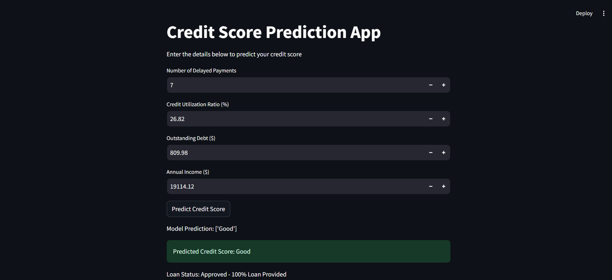
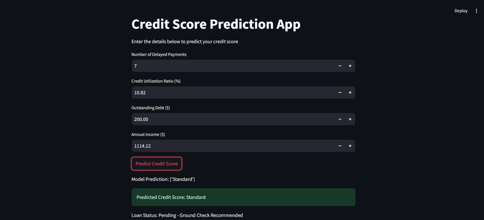

## Credit Score Predictor

# Overview
This project demonstrates the development of a Credit Score Prediction model that predicts an individual’s credit score based on their financial attributes. It utilizes machine learning models such as Logistic Regression and Random Forest for classification, along with an interactive Streamlit application to provide real-time predictions. The project involves data preprocessing, feature engineering, model training, and deployment.

# Key Highlights:
- Predict credit scores as Good, Poor, or Standard based on input financial data.
- User-friendly interface for seamless interaction.
- Accurate predictions using advanced machine learning models like Logistic Regression and Random Forest.

# Use Case
For example, a user with high credit utilization and a large amount of outstanding debt may receive a Poor credit score, while someone with low debt and a high annual income may be classified as Good.

# Features
- **Input**: Users can input key financial attributes such as number of delayed payments, credit utilization ratio, outstanding debt, and annual income.
- **Real-Time Prediction**: The app predicts the credit score category (Good, Poor, Standard) based on the input features.
- **Interactive UI**: Developed using Streamlit, offering an easy-to-use interface for predictions.

# Dataset Description
The dataset, sourced from financial data, includes features that help predict an individual’s credit score:

- **Financial Features**: Number of delayed payments, credit utilization ratio, outstanding debt, annual income.
- **Target Variable**: Credit score, which is classified into three categories (Good, Poor, Standard).

# Project Workflow
1. **Data Preprocessing:**
    - Address missing values, outliers, and inconsistencies.
    - Apply feature scaling using StandardScaler.
    - Perform label encoding for categorical target variable.
2. **Model Training:**
    - Algorithms used: Logistic Regression, Random Forest.
    - Feature Engineering: TF-IDF Vectorization for converting numerical features.
    - Model Evaluation: High performance with metrics such as accuracy, precision, and recall.
3. Deployment:
    - A real-time prediction system built using Streamlit, which serves as the user interface.

# Files Description
- **app.py:** Main Streamlit application file that serves as the prediction interface.
- **random_forest_pipeline.pkl:** Saved Random Forest model for prediction.
- **credit_score_data.csv:** Preprocessed dataset used for model training.
- **requirements.txt:** A file listing the Python packages needed to run the project.

# Visuals
Screenshot of the Application

# Model Performance
 - **Logistic Regression Accuracy:** 54%
     - Precision and Recall show potential for improvements in handling data class imbalances.
- **Random Forest Accuracy:** 74%
     - High precision and recall indicate a balanced performance in predicting the credit score categories.

# Results and Recommendations
- **Streamline Product Offerings:** Align financial product offerings based on customer preferences.
- **Targeted Marketing:** Focus marketing efforts on high-potential customer segments identified by the model.
- **Improved User Interface:** Enhance the interface for a more engaging user experience.

# Future Enhancements
- Expand Dataset: Incorporate more diverse financial data to enhance model performance.
- Predictive Analytics: Experiment with machine learning techniques for predicting future credit score trends.
- Multilingual Support: Enable the prediction of credit scores for users from different linguistic backgrounds.
- Advanced Models: Experiment with deep learning models and ensemble methods to further improve predictions.

# Technologies Used
- **Python:** Programming language for data processing and model development.
= **Streamlit:** Framework for building the interactive application.
- **scikit-learn:** Library used for machine learning algorithms.
- **Pandas:** Used for data manipulation and preprocessing.
- **NumPy:** Library for numerical operations.
- **Pickle:** To save the trained machine learning model for deployment.

# Conclusion:
The Credit Score Predictor project provides a comprehensive and effective tool for predicting an individual’s credit score based on financial attributes. By using machine learning algorithms such as Logistic Regression and Random Forest, the project successfully classifies users into credit score categories like Good, Poor, and Standard.

The system integrates various data preprocessing and feature engineering techniques to enhance model performance, and with the user-friendly interface developed using Streamlit, the tool provides real-time, interactive predictions. As a result, it becomes an invaluable asset for businesses or financial institutions looking to evaluate customer creditworthiness in a seamless and automated way.

With further improvements, the system could be expanded to include more granular credit score classifications, incorporate more advanced machine learning models, or integrate external financial data sources to provide a more holistic view of an individual’s financial health.
